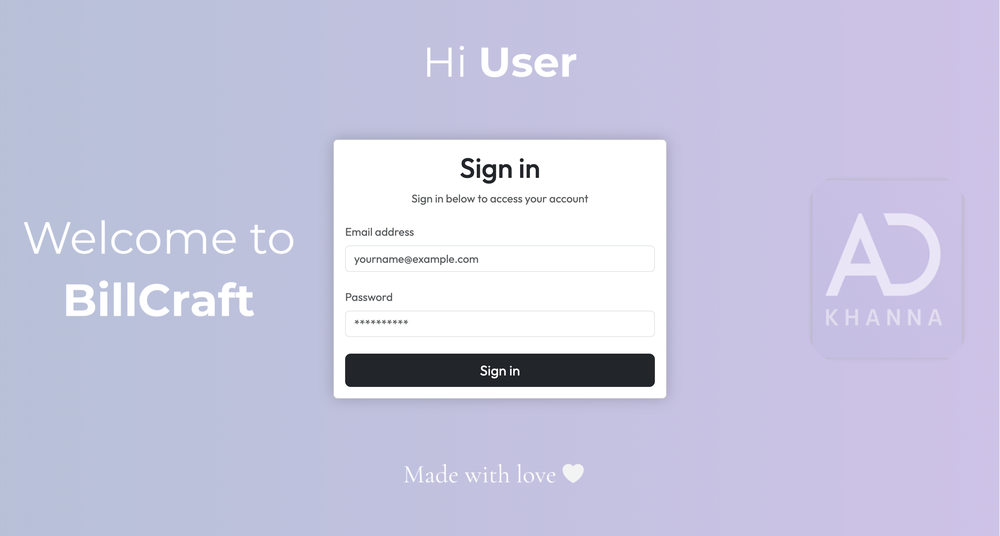
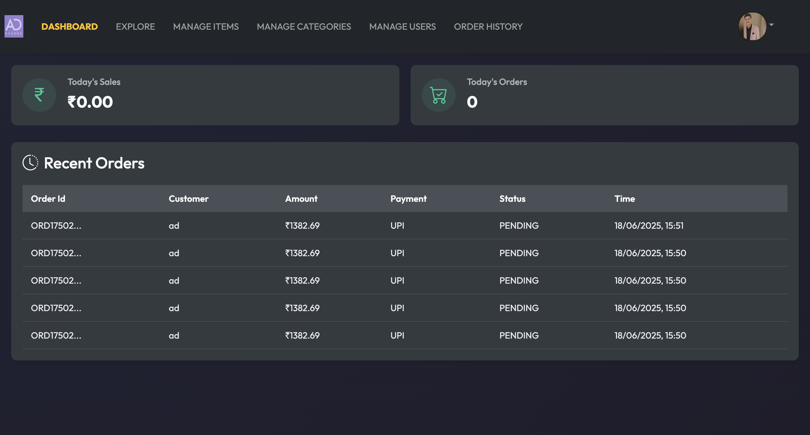
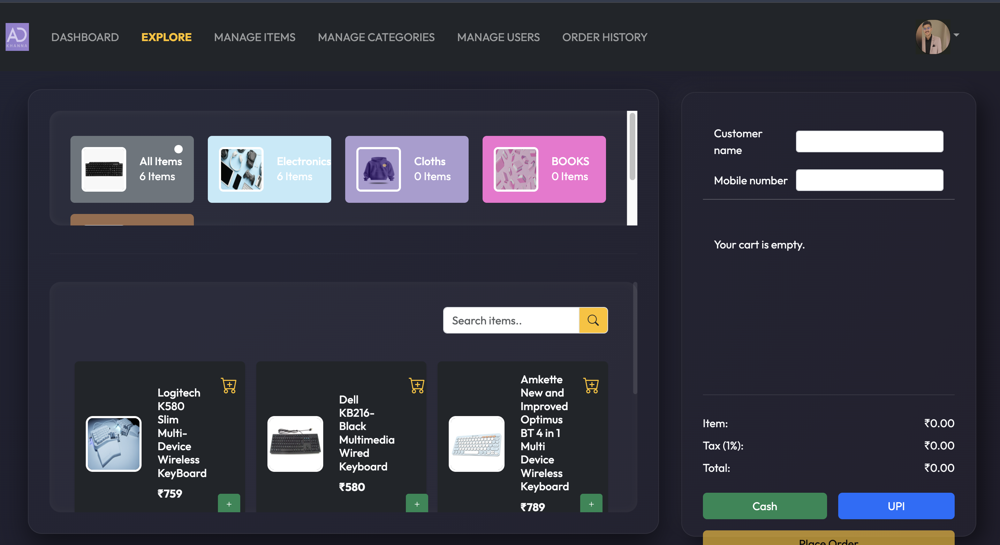
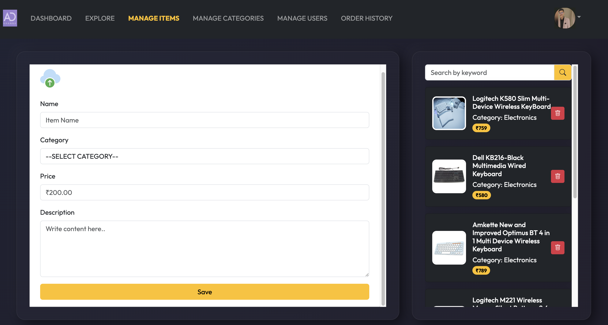
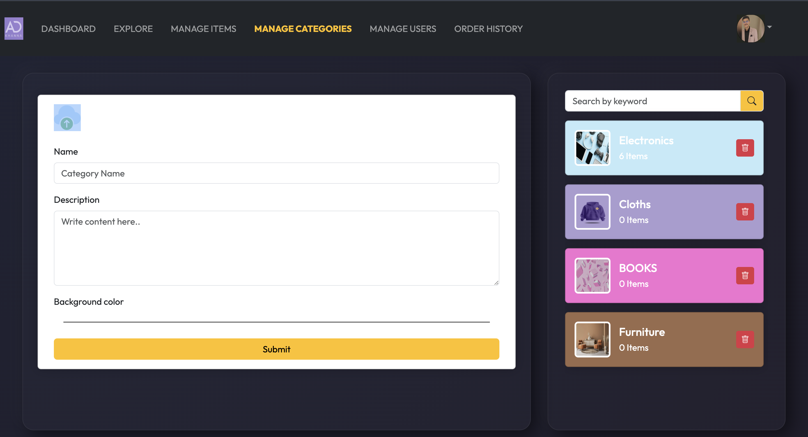
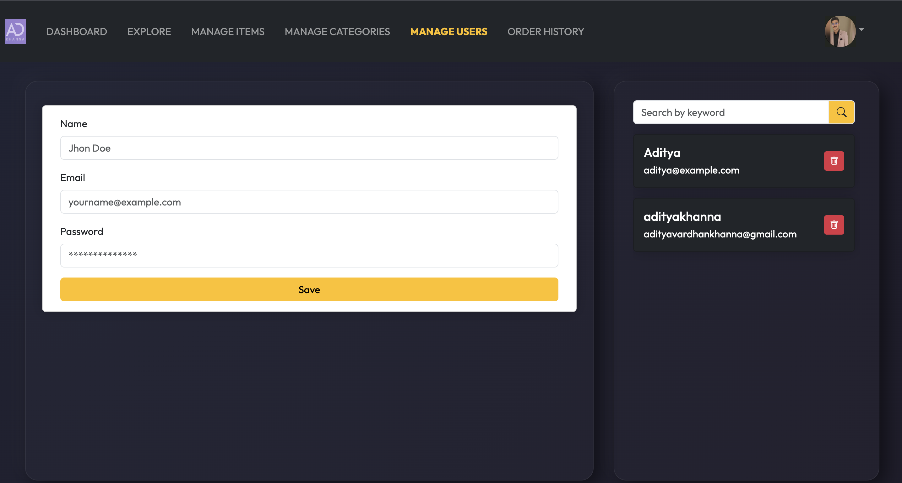
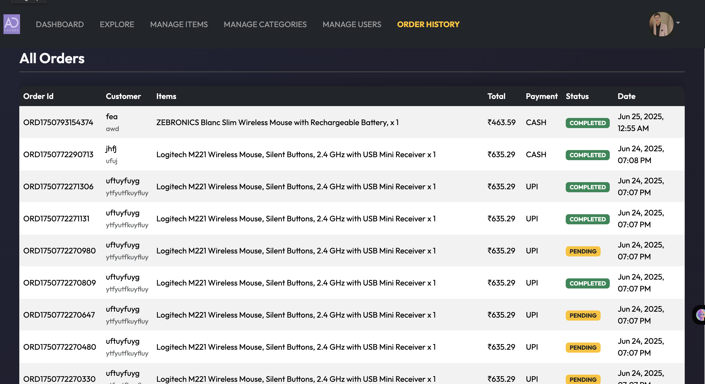

 🧾 Billing Software System

A complete full-stack billing software web application built using Spring Boot, React, and MySQL, with secure JWT Authentication,
file uploads to AWS S3, and payments handled by Stripe.

---

## ✨ Features

- 🔐 JWT-based Authentication (Login)
- 🧑‍💼 Role-based Access Control (Admin, User)
- 📦 Category & Item Management
- 🛒 Order Creation & Management
- 💳 Online Payments using Stripe
- 📁 File Upload to AWS S3
- 📊 Dashboard with analytics
- 🌐 React Frontend with REST API integration
- 🌍 Hosted on Render / Vercel

---

## ⚙️ Backend Stack

- Spring Boot(Hosted on Render)
- MySQL (Hosted on FreeSQLDatabase)
- Spring Security + JWT
- AWS S3 (for image uploads)
- Stripe API (for payments)
- Hibernate/JPA (for ORM)

---

## 🧑‍💻 Frontend Stack

- ReactJS
- Axios for API calls
- React Router
- Tailwind CSS / Bootstrap

---
## 🏗️ Live demo

https://drive.google.com/file/d/1CgWhjn-sa3dsj2dbc58fSxpnOLk9ieEm/view?usp=sharing
---

## 🏗️ Project Structure

##CONTROLLER
src/main/in/adityakhanna/billingsoftware/controller
##SERVICE
src/main/in/adityakhanna/billingsoftware/service
##ENTITY
src/main/in/adityakhanna/billingsoftware/entity
##REPOSITORY
src/main/in/adityakhanna/billingsoftware/repository
##SECURITY
src/main/in/adityakhanna/billingsoftware/security
##CONFIG
src/main/in/adityakhanna/billingsoftware/config

STEPS TO RUN THIS APPLICATION

✅ Prerequisites
Before running the project, make sure you have:

      ✅ Java 17+ installed
      
      ✅ Maven installed (mvn -v)
      
      ✅ Node.js + npm (node -v and npm -v)
      
      ✅ MySQL database created (e.g., freesqldatabase.com)
      
      ✅ AWS S3 bucket (for image uploads)
      
      ✅ Stripe account and secret key

1. Clone the Project

  git clone https://github.com/your-username/billingsoftware.git
  cd billingsoftware
   
2. Configure application.properties

Go to:
src/main/resources/application.properties
Update with your MySQL DB, AWS, JWT, Stripe details.

3. CHANGE API CALL
CHANGE YOUR REACT AXIOIS FUNCTION
MAKE SURE YOUR API IS CORRECTLY CALLING.

4. 🧩 Backend (Spring Boot)

./mvnw clean install
./mvnw spring-boot:run

5. 🖼️ Frontend (React)
cd client
npm install
npm run dev

### 🧾 Login Page

### 📊 Dashboard

### 🛍️ Explore Page

### 📂 Manage Categories

### 📦 Manage Items

### 👥 Manage Users

### 🧾 Orders

